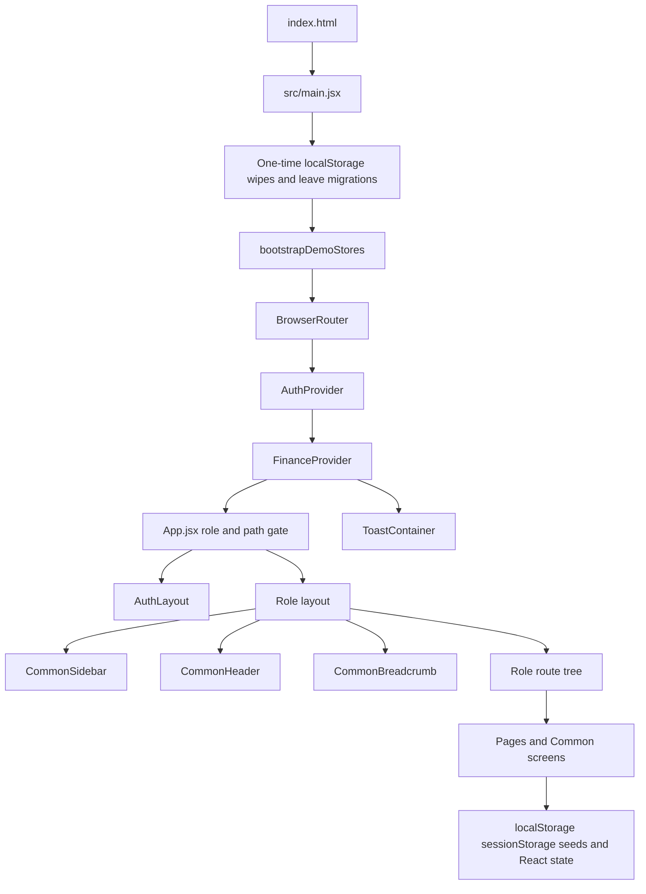
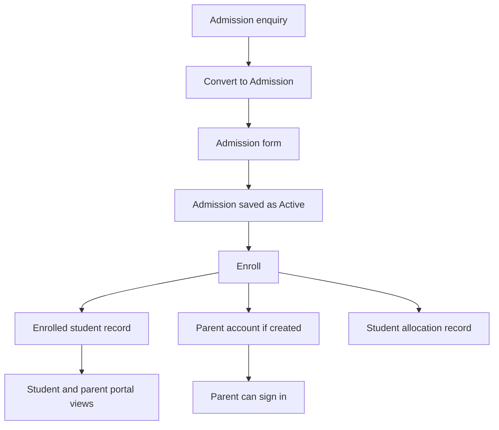

# School ERP Frontend Demo

This repository (`schoolerp-front`) is the frontend demo of the School ERP for **Queen Mira International School**. It is a single-page React application that shows the screens, forms, tables, role portals, and workflows the product is expected to support.

There is **no live backend** in this repository. Authentication, permissions, and almost all records live in the browser (`sessionStorage` and `localStorage`) or in hardcoded seed modules. Charts, maps, QR scanning, and print/export run entirely on the client.

Use this demo as a functional reference for UI behavior and for the data each screen expects. Do not treat the client-side stores, generated IDs, or status changes as production business rules.

---

## 1. Project Overview

School ERP, in this demo, is a role-based school operations portal. Each signed-in role gets one URL prefix, one layout (sidebar, header, breadcrumb), and one route tree. The school identity used on printed and branded surfaces is defined in `src/constants/schoolProfile.js`: Queen Mira International School, CBSE affiliation, Madurai address, and contact details.

The frontend was built so stakeholders can walk through admissions, academics, student and parent portals, operations, finance, HR, security, and audit without a server. It also shows how those areas connect in the browser: an enquiry can become an admission, an enrolled admission can create a student record and a parent login, leave requests move between “my requests” and “received requests”, and finance collections update a local ledger.

Who can use the demo:

| Audience | What they get |
|---|---|
| School stakeholders | Clickable workflows for review |
| Frontend developers | The current page, route, and component map |
| Backend / API developers | Required fields, actions, statuses, and relationships |

The demo login is not production authentication. Any six-digit OTP is accepted once the email matches the selected profile or a locally created account.

---

## 2. Project Objectives

The current codebase supports these objectives:

- Demonstrate ERP workflows across 27 roles.
- Let stakeholders review navigation, forms, tables, and status changes.
- Define the fields those forms collect (see especially admissions, user creation, leave, and fees).
- Show how modules relate in the browser (enquiry → admission → enrolled student → parent account → allocation).
- Show role-based navigation: one path prefix and one sidebar per role.
- Show the CRUD and approval actions the UI expects (view, add, edit, delete, approve, reject, convert, assign, enroll, print, export).
- Give the backend team a screen-level reference for future APIs.
- Show page transitions, including redirects from older URLs.

The demo does not yet prove server-side security, persistence, concurrency, or audit integrity.

---

## 3. Current Project Scope

Scope below is what the route trees and pages actually implement.

### Authentication

- Profile picker at `/select-profile`, sign-in at `/signin`, sign-up screen at `/signup`.
- Demo OTP login. Session is `sessionStorage` key `schoolerp_auth`.
- Created Admin, created staff, and enrolled parents can also sign in (see Authentication).

### Administration

- **Super Admin** (`/super-admin`): dashboard, attendance overview, user database, admin user creation, gate pass, transport overview, finance overview, audit reports, approvals, announcements, activity log.
- **Admin** (`/admin`): admissions and front-office staff lists, class and subject setup, attendance lists, library, student fees and documents, transport master data, exam details, expense lists, activities, task management, leave, TC approval, communication, calendar, notifications, escalations, RBAC (user creation and role matrix).
- Admin home after login is `/admin/front-office/admission-list`, not a dashboard. `/dashboard` and unknown admin paths render placeholder text (`Admin Dashboard` / `Admin Home`).

### Admissions and front office

- **PRM** uses prefix `/front-office` (`PRMLayout`, `FrontOfficeRoutes.jsx`).
- Admin and PRM share admission enquiry and admission screens.
- Also: student and parent lists, student transfer, re-enrollment, TC requests, student / hostel / material gate passes, goods received passes.

### Students and parents

- **Student** (`/student`) and **Parent** (`/parent`) share `StudentPortalRoutes.jsx`.
- Class (online class, extra class, timetable, attendance), results, exam schedule, analytics, deliverables, library, transport, hostel, fee/hostel/transport payment screens, notifications, announcements, TC requests, communication, escalations, academic calendar.
- Parent must choose a child at `/parent/select-child` before the portal chrome loads. Star ratings are omitted for parents. Parent bus-route details redirect to track-bus.

### Academics

- **Teacher** and **Coordinator**: class routine, online and extra class, lesson plans, mark entry, unit tests, deliverables (home fun, study materials, sample questions), exam types, star ratings, tasks, leave, communication. Question-bank and exam-schedule page files exist but are not mounted on these route trees.
- **Director** and **Principal**: approvals (lesson plans, mark entry), timetables, student allocation, star ratings, staff and student databases, tasks, announcements.
- Teacher and coordinator share several `localStorage` keys (lesson plans, marks, unit tests, deliverables).

### Staff and people operations

- **HR** (`/hr`): employees, documents, recruitment, onboarding, attendance, leave policies, training, performance, payroll (including payslip, CTC, advances, referral bonus, child concession, claims), disciplinary action, exit, reports, notifications, announcements.
- Shared **employee database** and **student database** views are reused by leadership roles.

### Operations

- **Canteen Manager**: dashboard, menu, inventory, orders, requests, reports, broadcast.
- **IT Support Manager**: assets, service history, transfers, support tickets, requests, maintenance inventory, procurement board, data import, reports, broadcast.
- **Stationery Store Manager**: inventory, issue/returns, requirements, stock issue, critical alerts, purchase workflow, reports, broadcast.
- **Housekeeping Manager**: inventory, duty allotment, schedules, lost and found, RO testing, star of the month, movements, purchase workflow, tasks, broadcast.
- **Transport Manager**: drivers, vehicles, routes, route data and bus tracking, student transport, duty assignment, maintenance, expenses and budget, requests.
- **Driver**: vehicle details and documents, health status, duty, route, student attendance, fuel and maintenance requests, leave.

### Finance

- **Account Head** (`/account-head`): dashboard, fees (structure, collection, concessions, defaulters, receipts, activity fees), collections, wallets, transport finance, accounting books, approvals, reports, payment vouchers, book-fee breakup, annual budget, fee projection, task management.
- `/account-head/mfp` is an explicit placeholder. The screen states that the MFP report template is waiting on a stakeholder specification.

### Gate and security

- **Gate Keeper**: dashboard, student and hostel gate passes, duty, incidents, visitor register, inward/outward register, handover, vendor registry, broadcasts, attendance, leave, communication, escalations.
- **Gate Keeper Manager**: duty assignment, leave approval, incidents, broadcasts, attendance of gatekeepers, academic calendar, communication, escalations.

### Audit

- **Joint Director Audit**: audit configuration (templates, question bank, scoring, publishing, versioning), assignment, monitoring, employee views, tasks, requests, announcements.
- **Process Auditor** and **Quality Auditor**: dashboards, my audits, schedule, execute audit, history, observations, root-cause analysis, action-taken reports, escalations, compliance and audit reports.

### Leadership operations

- **Joint Director** and **Joint Director Assistant**: dashboards, employee views (including drivers), request approvals, escalations, meetings calendar, assets and inventory, broadcast.
- **Director**: broadcast, academic oversight, leave, lesson-plan and mark-entry approval, student allocation, tasks.
- **Principal**: task management home, timetables, teacher allocation, LMS views, star ratings, user management.

### Cross-cutting modules

Present on many roles, usually through `src/Common`:

- Task management
- Leave requests
- Announcements
- Communication inbox (legacy direct-message URLs redirect into the inbox)
- Escalations
- Notifications
- Academic calendar
- Meetings calendar (leadership roles)

---

## 4. Technology Stack

Versions below are the ranges declared in `package.json`. The lockfile resolves exact installs.

| Category | Technology | Usage |
|---|---|---|
| Frontend | React 19 (`react`, `react-dom` ^19.2.4) | UI |
| Language | JavaScript (JSX) | Application source. No TypeScript in `src` |
| Build tool | Vite 8 (`vite` ^8.0.1) | Dev server and production build |
| React plugin | `@vitejs/plugin-react` ^6 | React Fast Refresh |
| Compiler | `babel-plugin-react-compiler` via `@rolldown/plugin-babel` | React Compiler preset in `vite.config.js` |
| Routing | `react-router-dom` ^7.13.2 | `BrowserRouter`, per-role `<Routes>` |
| Styling | Tailwind CSS 4 (`tailwindcss`, `@tailwindcss/vite` ^4.2.2) | Utility classes and `@theme` fonts |
| Icons | `lucide-react` ^1.7.0 | Sidebar and action icons |
| Charts | `echarts` ^6.1.0, `echarts-for-react` ^3.0.6 | Dashboards and analytics |
| Maps | `leaflet` ^1.9.4, `react-leaflet` ^5.0.0 | Bus tracking map |
| Dates | `date-fns` ^4.4.0, `react-datepicker` ^9.1.0 | Date fields and calendars |
| Selects | `react-select` ^5.10.2 | Multi/searchable selects |
| Toasts | `react-toastify` ^11.0.5 | Save and action feedback |
| QR | `html5-qrcode` ^2.3.8 | Librarian issued-book scanner |
| Lint | ESLint 9 + `eslint-plugin-react-hooks`, `eslint-plugin-react-refresh` | `npm run lint` |
| Deploy | `vercel.json` | SPA rewrite of all paths to `/` |
| License | Apache 2.0 | `LICENSE` |

Not used: TypeScript for app code, Redux, Zustand, TanStack Query, Axios, Formik, React Hook Form, Yup, or Zod. Forms are controlled React state with hand-written checks. `tslib` is a dependency but the app source is JSX.

---

## 5. Application Architecture



### Entry

`index.html` mounts `#root` and loads `src/main.jsx`. The document title is `QMIS School ERP - Demo`.

Before React renders, `main.jsx`:

1. Runs one-time localStorage wipes (academics, front-office passes, activities, announcements, leave, tasks, escalations, documents).
2. Migrates legacy and session leave requests into the current localStorage shape.
3. Calls `bootstrapDemoStores()` so housekeeping occurrences, finance due notifications, inventory, IT tickets, approvers, and closure rules are seeded.

Then it renders:

```jsx
<BrowserRouter>
  <AuthProvider>
    <FinanceProvider>
      <App />
      <ToastContainer position="top-right" autoClose={2500} newestOnTop closeOnClick />
    </FinanceProvider>
  </AuthProvider>
</BrowserRouter>
```

`FinanceProvider` (`src/Pages/AccountHead/financeDomain/FinanceContext.jsx`) is app-wide. Account Head screens, and some demo finance widgets, read and write that context. It persists under `school_erp_finance_state_v1`.

### Gate

`App.jsx` decides the shell:

1. `/select-profile`, `/signin`, `/signup` render `AuthLayout`. An already signed-in user is sent to that role’s home.
2. Anyone else who is not signed in is sent to `/select-profile`.
3. Legacy `/van-driver` URLs redirect to `/driver`. Old admin van-driver list, add, and view URLs redirect to driver URLs.
4. The signed-in role must match its path prefix. A mismatch redirects to `ROLE_HOME_PATHS[role]`.
5. Joint Director is special: `/joint-director-assistant` and `/joint-director-audit` are excluded so those roles keep their own shells.
6. A signed-in user on an unknown role falls through to the Admin home path.

There is no global 404 page. Most role trees end with `<Route path="*" />` that redirects to that role’s dashboard. Admin’s catch-all renders the text `Admin Home`. Librarian’s dashboard and catch-all render the text `Librarian Dashboard`.

### Layout

Typical shell (`AdminLayout` and the other role layouts):

- `CommonSidebar` — links chosen from the URL prefix
- `CommonHeader` — title from `getPageTitle(pathname)`, plus profile and notification UI
- `CommonBreadcrumb` — trail from breadcrumb mappings
- The role’s route component

Sidebar collapse is local React state. Below 1024px the sidebar starts hidden; a backdrop closes it.

Student and Parent layouts also mount `ActiveStudentContext`. Parent layout mounts `ParentChildContext` and does not show the main chrome until a child is selected.

---

## 6. Complete Project Structure

```text
school-erp-demo/
├── index.html
├── package.json
├── package-lock.json
├── vite.config.js          # React, Tailwind, React Compiler
├── eslint.config.js
├── vercel.json             # SPA fallback
├── LICENSE                 # Apache 2.0
├── README.md
├── public/
│   └── icons.svg
└── src/
    ├── main.jsx            # Bootstrap, wipes, providers
    ├── App.jsx             # Auth and role switchboard
    ├── App.css
    ├── index.css           # Tailwind and font tokens
    ├── assets/images/      # Logos and profile images
    ├── constants/          # roles.js, portalLogo.js, schoolProfile.js
    ├── context/            # Auth, active student, parent-child
    ├── Layout/             # One shell per role, plus AuthLayout
    ├── Routes/             # One route tree per role
    ├── Pages/              # Screens grouped by role or domain
    └── Common/             # Shared chrome, workflows, and demo stores
```

| Folder | Responsibility |
|---|---|
| `src/constants` | Role IDs, portal logo, school name and contact lines |
| `src/context` | Session auth, the student the portal is viewing, the parent’s selected child |
| `src/Layout` | Chrome only. Feature UI stays in `Pages` and `Common` |
| `src/Routes` | URL to page component. Shared helpers are injected here |
| `src/Pages` | Role or domain screens and their colocated `*Data.js` modules |
| `src/Pages/Authentication` | Profile picker, sign-in, sign-up, profile labels, module groups |
| `src/Pages/AccountHead/financeDomain` | Finance context, masters, calculations, local persistence |
| `src/Pages/HR/domain` | HR store, seed, payroll math, status helpers |
| `src/Common` | Sidebar, header, breadcrumb, and cross-role features |
| `src/Common/demoDomain` | Shared demo stores: inventory, tickets, security, procurement, biometric, activity log, governance |
| `public` | Static files served at the site root |

`src/Pages` role folders: `AccountHead`, `Admin`, `Authentication`, `CanteenManager`, `Coordinator`, `Director`, `Driver`, `FrontOffice`, `Gatekeeper`, `GateKeeperManager`, `HousekeepingManager`, `HR`, `ITSupportManager`, `JointDirector`, `JointDirectorAssistant`, `JointDirectorAudit`, `Librarian`, `Parent`, `Principal`, `ProcessAuditor`, `QualityAuditor`, `StationeryStoreManager`, `Student`, `SuperAdmin`, `Teacher`, `TransportManager`.

Do not treat `node_modules`, `dist`, or `tmp/` as application source. `tmp/` holds local PDF and extraction artifacts and is not part of the app.

---

## 7. Routing Structure

Routing is not one central route table. `App.jsx` picks a layout. That layout renders one file from `src/Routes/`. Routes are absolute paths (`/teacher/...`), not nested relative paths.

| Kind | Behavior |
|---|---|
| Public | `/select-profile`, `/signin`, `/signup` |
| Protected | Every other path. Unsigned users go to `/select-profile` |
| Role prefix | Must match the signed-in role, or the app redirects home |
| Parameterized | `:id`, `:conversationId`, `:roleKey`, `:section` on view, edit, inbox, and accounting routes |
| Redirects | Legacy van-driver URLs, old direct messages, old leave and notification paths, index paths such as `/hr/payroll` |
| Not found | Role catch-all. No shared 404 component |

Student routes are built in `StudentPortalRoutes.jsx` with a `routePrefix` of `/student` or `/parent`. Parent adds `/parent/select-child` in `ParentRoutes.jsx`.

`TaskManagementRoutes({ basePath })` injects assign-tasks, add, my-tasks, and assigned-tasks under many prefixes. `StudentStarRatingsRoutes` injects star-of-month, star-of-year, add-ratings, and the SOM matrix where a role includes it.

There are on the order of 870 `<Route>` declarations. The tables in section 9 list the functional screens. Create, view, and edit URLs live in the same route file and follow the list path (`/add`, `/view/:id`, `/edit/:id`).

### Role homes

| Role | Prefix | Layout | Route file | Home |
|---|---|---|---|---|
| Super Admin | `/super-admin` | `SuperAdminLayout` | `SuperAdminRoutes.jsx` | `/super-admin/dashboard` |
| Admin | `/admin` | `AdminLayout` | `AdminRoutes.jsx` | `/admin/front-office/admission-list` |
| Student | `/student` | `StudentLayout` | `StudentRoutes.jsx` | `/student/class/online-class` |
| Parent | `/parent` | `ParentLayout` | `ParentRoutes.jsx` | `/parent/select-child` |
| Librarian | `/librarian` | `LibrarianLayout` | `LibrarianRoutes.jsx` | `/librarian/book-management/book-list` |
| PRM | `/front-office` | `PRMLayout` | `FrontOfficeRoutes.jsx` | `/front-office/admission-enquiry` |
| Gate Keeper | `/gate-keeper` | `GateKeeperLayout` | `GateKeeperRoutes.jsx` | `/gate-keeper/dashboard` |
| Gate Keeper Manager | `/gatekeeper-manager` | `GateKeeperManagerLayout` | `GateKeeperManagerRoutes.jsx` | `/gatekeeper-manager/assign-duty-list` |
| Director | `/director` | `DirectorLayout` | `DirectorRoutes.jsx` | `/director/broadcast` |
| Principal | `/principal` | `PrincipalLayout` | `PrincipalRoutes.jsx` | `/principal/task-management` |
| Teacher | `/teacher` | `TeacherLayout` | `TeacherRoutes.jsx` | `/teacher/dashboard` |
| Coordinator | `/coordinator` | `CoordinatorLayout` | `CoordinatorRoutes.jsx` | `/coordinator/dashboard` |
| Canteen Manager | `/canteen-manager` | `CanteenManagerLayout` | `CanteenManagerRoutes.jsx` | `/canteen-manager/dashboard` |
| IT Support Manager | `/it-support-manager` | `ITSupportManagerLayout` | `ITSupportManagerRoutes.jsx` | `/it-support-manager/dashboard` |
| Stationery Store Manager | `/stationery-store-manager` | `StationeryStoreManagerLayout` | `StationeryStoreManagerRoutes.jsx` | `/stationery-store-manager/dashboard` |
| Housekeeping Manager | `/housekeeping-manager` | `HousekeepingManagerLayout` | `HousekeepingManagerRoutes.jsx` | `/housekeeping-manager/dashboard` |
| Transport Manager | `/transport-manager` | `TransportManagerLayout` | `TransportManagerRoutes.jsx` | `/transport-manager/dashboard` |
| Driver | `/driver` | `DriverLayout` | `DriverRoutes.jsx` | `/driver/vehicle-management/vehicle-details` |
| Joint Director | `/joint-director` | `JointDirectorLayout` | `JointDirectorRoutes.jsx` | `/joint-director/dashboard` |
| Joint Director Assistant | `/joint-director-assistant` | `JointDirectorAssistantLayout` | `JointDirectorAssistantRoutes.jsx` | `/joint-director-assistant/dashboard` |
| Joint Director Audit | `/joint-director-audit` | `JointDirectorAuditLayout` | `JointDirectorAuditRoutes.jsx` | `/joint-director-audit/dashboard` |
| Process Auditor | `/process-auditor` | `ProcessAuditorLayout` | `ProcessAuditorRoutes.jsx` | `/process-auditor/dashboard` |
| Quality Auditor | `/quality-auditor` | `QualityAuditorLayout` | `QualityAuditorRoutes.jsx` | `/quality-auditor/dashboard` |
| HR | `/hr` | `HRLayout` | `HRRoutes.jsx` | `/hr/dashboard` |
| Account Head | `/account-head` | `AccountHeadLayout` | `AccountHeadRoutes.jsx` | `/account-head/dashboard` |

Role IDs are in `src/constants/roles.js` (`superadmin`, `admin`, `prm`, and so on). Legacy role `vandriver` is normalized to `driver` when a session is read.

---

## 8. Navigation Structure

Navigation is configured, not generated from the router.

| Piece | File | What it does |
|---|---|---|
| Sidebar | `src/Common/CommonSidebar/Components/sidebarLinks.js` | One exported array per role, plus `roleBasedSidebarLinks` |
| Sidebar picker | `src/Common/CommonSidebar/CommonSidebar.jsx` | Chooses the array from the **pathname prefix**, not from the auth role directly |
| Header title | `src/Common/CommonHeader/Components/TitleMappings.jsx` | `getPageTitle(pathname)` |
| Breadcrumb | `src/Common/CommonBreadcrumb/breadcrumbMappings.js` | Trail under the header |
| Profile menu | `src/Common/CommonHeader/Components/UserDropdown.jsx` | Account menu and logout |
| Header notifications | `src/Common/CommonHeader/Components/UserNotifications.jsx` | Notification dropdown |

A new screen needs all four wires: route, sidebar entry, title mapping, and breadcrumb mapping. `App.jsx` only changes when a **new role** is added.

### Menu visibility

- Default demo users see the full sidebar for their prefix.
- **Created Admin users** (not the system `admin@school.com` account) are filtered by `getFilteredAdminSidebarLinks()` using permissions stored on that admin record. Dashboard stays visible (`alwaysOn`).
- **Teacher** and **Coordinator** sidebars are filtered only after at least one module is enabled in the Admin RBAC matrix (`schoolerp-role-permissions`). Until then, the full sidebar remains. Mapped items are lesson plans, task management, unit tests, mark entry, and deliverables. Unmapped items stay visible.
- The RBAC matrix does not hide buttons inside a page. It filters those sidebars.
- Parent and student menus differ because they are separate link arrays, and because `StudentPortalRoutes` flags turn star ratings and bus-route details off for parents.

Submenus use `to: "#0"` plus a `subLinks` array. Active state is prefix matching on `location.pathname`.

---

## 9. Module and Page Documentation

Shared behaviors used by many pages:

- **Search** filters the in-memory list.
- **Status badges** are Tailwind class maps (`Active`, `Pending`, `Approved`, and similar).
- **Row actions** use `src/Common/CommonComponents/Dropdown.jsx` (ellipsis menu).
- **Export** often opens `ExportModal`. Export is a client-side demo action, not a server file.
- **Print** uses `src/Common/printDocument.js` (`window.open` plus `print`, or an HTML download).
- **File fields** keep a file name or data URL in state. Nothing is uploaded to a server.
- **Pagination** is real on some lists (material gate pass, goods received pass). On others, including admission enquiry, the pager is visual and the list is only sliced by an entries-per-page control.
- **Data** is demo data unless a row below says otherwise.

### Shared workflows

These screens are mounted under many prefixes. Documented once.

#### Task management

**Routes:** `/{prefix}/task-management`, `/assign-tasks`, `/assign-tasks/add`, `/my-tasks`, `/assigned-tasks`

**Purpose:** Assign work and update task status.

**UI:** List, add form, status modal, attachment field, user multi-select.

**Actions:** Add, view my tasks, update status.

**Data:** `localStorage` key `school-erp-task-management`. A one-time wipe clears it (`schoolerp-task-management-wipe-v1`).

**Backend later:** Task CRUD, assignees, status transitions, attachment storage, notifications.

#### Leave request

**Routes:** `/{prefix}/leave-request/my-requests`, `/add`, `/view/:id`, and `/received` plus view where that role approves.

**Purpose:** Staff apply for leave. Approver roles see a received list.

**Fields:**

| Field | Type | Required | Description |
|---|---|---|---|
| Leave type | Select | Yes | Sick, Casual, Emergency, Personal, Medical, Week-Off, Permission |
| From date / To date | Date | Yes | Total days are calculated in the client |
| From time / To time | Time | When type is Permission | Permission cannot exceed 2 hours in the client check |
| Reason | Text | Yes | Free text |
| Requested to | Read-only | — | Label from `leaveRequestConfigs.js`, not a user picker |

**Statuses:** `Pending`, `Approved`, `Rejected`.

**Actions:** Submit, view, approve, reject (on received requests).

**Data:** `localStorage` `schoolerp-leave-requests`. Legacy per-role keys are migrated on startup. A one-time wipe flag is `schoolerp-leave-requests-wipe-v1`.

**Backend later:** Balances, holidays, approver chain, and status changes must be enforced on the server. The client currently writes the new status itself.

#### Announcements

**Routes:** `/{prefix}/announcement` or `/broadcast`, plus add and `view/:id`.

**Actions:** List, add, view. Some roles are view-only.

**Data:** `localStorage` `school-erp-announcements`, wiped once by `schoolerp-announcements-wipe-v1`.

#### Communication

**Routes:** `/{prefix}/communication/inbox` and `/:conversationId`. Old `/direct-messages` paths redirect into the inbox.

**UI:** Inbox list and chat panel.

**Data:** `localStorage` `schoolerp_communication_v1`.

#### Escalations

**Routes:** `/{prefix}/escalation-management`, `/add-escalation`, `/view/:id`.

**UI:** List, form, recipient `react-select`.

**Data:** `localStorage` `schoolerp-escalations`. Wipe flag `schoolerp-escalation-management-wipe-v2` also clears legacy per-role keys.

#### Academic calendar and notifications

Calendar pages reuse `src/Common/AcademicCalendar`. Notification lists are mostly static arrays in `*notificationsData.js` or `staffNotificationsData.js`. Coordinator and teacher notification records can persist under `teacher-notifications`.

---

### Authentication

#### Select profile

**Route:** `/select-profile`

**Purpose:** Pick the role before sign-in. Groups come from `roleModuleConfig.js`: Super Admin, Admin, Academics, Operations, Audit, Finance.

**Data:** Static profile options. Sets `pendingRole` in auth context, then navigates to `/signin`.

#### Sign in

**Route:** `/signin`

**Purpose:** Email plus 6-digit OTP for the pending role.

**Fields:** Email, OTP. OTP is required and must be 6 characters. The value is not checked against a server or a stored password.

**Data:** `FAKE_CREDENTIALS` in `AuthContext.jsx`, plus created admins, created users, and parent accounts. See section 14.

#### Sign up

**Route:** `/signup`

**Purpose:** Screen is routed. It is not the path that creates staff or parents. Those are created inside Admin RBAC, Super Admin user creation, and admission enrollment.

---

### Super Admin

**Route file:** `src/Routes/SuperAdminRoutes.jsx`

| Route | Purpose | Data |
|---|---|---|
| `/super-admin/dashboard` | KPI cards and charts | Seed metrics and ECharts |
| `/super-admin/attendance/students/list` | Student attendance overview | Static / local attendance data |
| `/super-admin/attendance/employees` | Employee attendance overview | Static / local attendance data |
| `/super-admin/user-database/students` | Student database list and view | Shared student database |
| `/super-admin/user-database/employees` | Employee database list and view | Shared employee database |
| `/super-admin/user-creation` | Create Admin users and module permissions | `sessionStorage` `schoolerp-super-admin-admin-users` |
| `/super-admin/gate-pass` | Gate pass overview | Local gate-pass data |
| `/super-admin/transport-overview` | Transport summary | `transportOverviewData.js` |
| `/super-admin/finance/overview` and `/fees`, `/collections`, `/wallets`, `/transport`, `/accounting`, `/reports` | Finance overview charts | Finance context and seed figures |
| `/super-admin/audit-reports/overview` plus compliance, department ranking, pending and critical findings, risk dashboard | Audit report views | Seed audit data and charts |
| `/super-admin/approvals` | Approval queue | `sessionStorage` `schoolerp-super-admin-approvals` |
| `/super-admin/star-ratings/star-of-month` and `star-of-year` | Star ratings | SOM stores |
| `/super-admin/leave-request/received` | Leave received by Super Admin | Shared leave store |
| `/super-admin/announcement` | Announcements | Shared announcement store |
| `/super-admin/activity-logs/demo-activity` and sibling log views (`login-history`, `data-changes`, `deleted-records`, `approval-actions`, `audit-logs`, `failed-logins`) | Activity log screens | `localStorage` `schoolerp-system-activity-log-v1` |
| `/super-admin/reentry`, `/super-admin/module-health` | Re-entry requests and a module health view | Governance demo store |

**User creation fields** (Admin accounts): name parts, email, mobile, employee ID, department, username, password, status (`Active` / `Inactive`), and a permission map. Password is required in the client check and is stored in `sessionStorage` in plain text. That storage must not be copied into production.

**Actions:** Create admin, set permissions, approve or reject items in the approvals list, view databases.

**Backend later:** Real admin provisioning, hashed credentials, server-side permission checks, and a real approval workflow.

---

### Admin

**Route file:** `src/Routes/AdminRoutes.jsx`

Admin reuses the front-office admission components. Unique admin areas:

| Area | Routes | Purpose | Data |
|---|---|---|---|
| Admissions | `/admin/front-office/admission-list`, `admission-enquiry`, teachers, librarians, drivers | Enquiry, admission, and staff lists | See section 11 for admissions. Staff forms are local page state / data modules |
| Attendance | `/admin/attendance/students-list`, `employees-list` | Attendance lists | Static attendance modules. Old leave URLs redirect to leave requests |
| Class | `/admin/class/class-details`, `online-class`, `extended-class`, `timetable-list`, `subjects` | Class setup and subjects | Page data modules and local state |
| Library | `/admin/library-details/book-list`, `issued-book` | Books and issued books | Local library data |
| Students | `/admin/student/student-details`, `class-fee-details`, `parent-details`, `student-transfer` | Student, parent, fee, and transfer lists | Local modules |
| Documents | `/admin/documents/student-documents`, `employee-documents` | Upload metadata for student and employee documents | `localStorage` `schoolErpAdminStudentDocuments`, `schoolErpAdminEmployeeDocuments`, `schoolErpAdminEmployeeDocumentTypes` |
| Transport | `/admin/transport/vehicle-details`, `route-details`, `route-data`, `assigned-route` | Vehicle, route, and assignment masters | Local transport modules |
| Exams | `/admin/exam-details/exam-details-list` | Exam detail records | Local exam module |
| Expenses | `/admin/expenses/salaries-list`, `hostel-list`, `transport-list`, `library-list`, `others-list` | Expense lists and add forms | Local expense modules |
| User database | `/admin/user-management/student-database`, `employee-database` | Shared list and detail views | Shared database modules |
| RBAC | `/admin/rbac/user-creation`, `/admin/rbac/roles` | Create staff users and edit the role permission matrix | `localStorage` `schoolerp-created-users`, `schoolerp-role-permissions` |
| Activities | `/admin/activities/...` | Sports, cultural, competitions | `localStorage` `school-erp-activities` |
| Also | tasks, leave, TC approval, escalations, inbox, calendar, notifications, announcements | Shared workflows | Shared stores |

**RBAC user-creation fields** (`DEFAULT_USER_FORM` in `createdUsersData.js`): role, status, name parts, email, gender, profile image, address (street, city, state, country, pincode), mobile numbers, religion, caste, date of birth, blood group, height, weight, medical history, father and mother names, family contact, qualification, experience, previous school, joining date, username, password, ID proof, qualification certificate, experience certificate, and optional class, section, roll number, admission number.

Creatable roles: Principal, PRM, Teacher, Coordinator, Librarian, Gate Keeper Manager, Gate Keeper. IDs are client-generated (`PRC`, `PRM`, `TEA`, `CRD`, `LIB`, `GKM`, `GKP`).

**Roles page:** toggles the module keys in section 15. Saved to `schoolerp-role-permissions`. This does not change route access. It can filter Teacher and Coordinator sidebars.

**Backend later:** Persist masters, documents, and users. Authorization must be checked on every API, not only in the sidebar.

---

### Front office (PRM)

**Route file:** `src/Routes/FrontOfficeRoutes.jsx`  
**Home:** `/front-office/admission-enquiry`

Same admission enquiry and admission components as Admin, with paths under `/front-office`.

| Route | Purpose | Data |
|---|---|---|
| `/front-office/admission-enquiry` | Enquiry list | `localStorage` `schoolerp-admin-admission-enquiries` (shared with Admin) |
| `/front-office/add-admission` | Admission form | `localStorage` `schoolerp-admin-admissions` |
| `/front-office/admission-list` | Saved admissions | Same admission store |
| Student and parent management | Lists of students and parents | Front-office database modules |
| `/front-office/student-transfer` | Transfer records | Local transfer data |
| `/front-office/student-re-enrollment` | Re-enrollment | `localStorage` `front-office-student-re-enrollment` |
| TC requests | List and view | `sessionStorage` `schoolerp-tc-requests` |
| `/front-office/gate-pass-list` | Student gate passes | `localStorage` `student-gate-pass-front-office` plus counter |
| `/front-office/hostel-gate-pass-list` | Hostel passes | `hostel-gate-pass-front-office` plus counter |
| `/front-office/material-gate-pass-list` | Material passes | `material-gate-pass-front-office` plus counter. Client pagination |
| `/front-office/goods-received-pass-list` | Goods inward | `goods-received-pass-front-office` plus counter. Client pagination |
| `/front-office/student-management`, `teacher-management`, `parent-management` | People lists | Front-office database modules |

Pass stores are cleared once by `schoolerp-front-office-pass-wipe-v1`.

**Actions:** Add, edit, view, delete, status updates, convert enquiry to admission, approve gate-pass sections where the form includes an approval block.

**Backend later:** Pass numbers, counters, and approval states must be issued by the server. Enquiry and admission must be one transaction, not two browser stores plus `location.state`.

---

### Student and Parent

**Route files:** `StudentRoutes.jsx`, `ParentRoutes.jsx`, `StudentPortalRoutes.jsx`

Parent-only:

| Route | Purpose | Data |
|---|---|---|
| `/parent/select-child` | Choose which child the portal shows | `ParentChildContext`, `sessionStorage` key prefix for the parent id |
| `/parent/dashboard` | Parent dashboard component | Demo student profile |

Shared portal screens (prefix `/student` or `/parent`):

| Route | Purpose | Data |
|---|---|---|
| `/dashboard` | Student or parent dashboard | `ActiveStudentContext` and demo profile |
| `/class/online-class` | Online class details | Student home. Static class data |
| `/class/extra-class` | Extra class | Omitted only if the flag is off. Parent includes it |
| `/class/timetable-list` | Timetable. Parent is weekly-only | Static timetable |
| `/class/attendance-list` | Attendance chart | Static series. A commented `fetch('/api/attendance')` is not called |
| `/class/attendance-report` | Attendance report | Static |
| `/student-evaluation/exam-result` | Results | Static |
| `/student-evaluation/exam-schedule` | Exam schedule | Static |
| `/student-evaluation/analytics` | `StudentAnalyticsPage` | Demo charts |
| `/student-deliverables/home-fun` | Home fun, student view of teacher pages | `localStorage` `teacher-home-fun-deliverables` and `student-home-fun-submissions` |
| `/student-deliverables/study-materials` | Study materials | `teacher-student-deliverables-study-materials` |
| `/student-deliverables/sample-questions` | Sample questions | `teacher-student-deliverables-sample-questions` |
| `/library/borrowed-books-list` | Borrowed books | Static |
| `/transport/bus-route-details` | Bus route. Parent redirects to track-bus | Static route data |
| `/transport/track-bus` | Map tracking. Parent can show route details on this page | Leaflet and demo coordinates |
| `/hostel/hostel-details` | Hostel info | Static |
| `/payment/fees-payment` | Fee payment UI | Demo payment, not a gateway |
| `/payment/hostel-payment` | Hostel payment UI | Demo |
| `/payment/transport-payment` | Transport payment UI | Demo |
| `/notifications` | Notifications. Old exam/event/holiday/payment URLs redirect here | Static |
| `/announcement` | Announcements | Shared store |
| `/tc-request` | Raise and view TC | `sessionStorage` `schoolerp-tc-requests` |
| `/star-ratings/view-ratings` | Student only | `localStorage` `student-star-ratings-som` |
| `/academic-calendar` | Calendar | Shared calendar |
| `/communication/inbox` | Inbox | Shared communication store |
| `/escalation-management` | Escalations | Shared escalation store |

**Backend later:** Scope every query to the authenticated student or to the parent’s linked children. Do not trust `ActiveStudentContext` or `sessionStorage` for authorization.

---

### Teacher and Coordinator

**Route files:** `TeacherRoutes.jsx`, `CoordinatorRoutes.jsx`

The two trees match. Replace `/teacher` with `/coordinator` for the same screen. They share storage keys, so a record saved in one portal appears in the other.

| Route under `/teacher` or `/coordinator` | Purpose | Data |
|---|---|---|
| `/dashboard` | Landing | Demo widgets |
| `/attendance/my-attendance`, `/attendance/class-attendance` | Own attendance and class attendance. `/attendance` and `/attendance-history` redirect to my attendance | Local attendance modules |
| `/attendance/biometric` | Biometric demo. Teacher route allows override | `schoolerp-biometric-attendance-v1` |
| `/class/class-routine` | Class routine | Local routine data |
| `/class/online-class`, `/class/extra-class` | Add and view online or extra class | Local class modules |
| `/student-evaluation/mark-entry` | Mark entry submitted for approval | `teacher-mark-entry-sessions` |
| `/student-evaluation/exam` | Exam types screen | `examTypes` demo helper |
| `/student-evaluation/analytics` | Analytics charts | Demo charts |
| `/unit-tests` | Unit test list, add, view | `teacher-unit-tests` |
| `/lesson-plan-approval` and `/add` | Submit a lesson plan | `school-erp-lesson-plan-approvals` |
| `/lesson-plan/my-lesson-plan` | Plans already submitted | Same store |
| `/lesson-plan-approval/group/:teacherName/:subject` | Plan group detail | Same store |
| `/student-deliverables/home-fun`, `study-materials`, `sample-questions` | Publish work. Each has add and view | Shared teacher deliverable keys |
| `/user-management/students-list` and `/view/:id`, `/view/:id/full` | Student list and detail charts | Static student lists |
| `/user-management/parents-list` | Parents | Static |
| `/library/books-borrowed` | Borrowed books | Static |
| `/star-ratings/star-of-month`, `star-of-year`, `add-ratings`, `som-matrix` | Ratings | SOM stores |
| `/student-allocation` | Redirects to the dashboard. Not an active screen | — |
| `/my-profile` | Profile card for the role label | Demo profile |
| Tasks, leave, announcements, inbox, notifications, escalations, academic calendar | Shared workflows | Shared stores |

**Lesson plan template:** `src/Common/LessonPlanApproval/lessonPlanTemplate.js` and `LessonPlanEntryForm.jsx` define the plan sections the approval screens render.

Page files exist for question banks, exam schedule creation, enter-marks, and result summary under `src/Pages/Teacher` and `src/Pages/Coordinator`, and they can read `teacher-question-banks`, `teacher-exam-schedules`, `teacher-enter-marks`, and `teacher-result-summary`. They are **not registered** in `TeacherRoutes.jsx` or `CoordinatorRoutes.jsx`. The student exam schedule screen does import `getExamSchedules` from the teacher exam-schedule data module.

**Backend later:** Separate teacher and coordinator records by user id. Approval must be a server transition, not a local status string. Do not build APIs for unmounted screens until those screens are actually in the route tree.

---

### Director and Principal

| Area | Routes | Purpose | Data |
|---|---|---|---|
| Director broadcast | `/director/broadcast` | Director home | Announcement store |
| Lesson plan approval | `/director/lesson-plan-approval`, also Principal | Review submitted plans | Shared lesson-plan store |
| Mark entry approval | `/director/mark-entry-approval` | Review mark sessions | `teacher-mark-entry-sessions` |
| Student allocation | Director allocation list and detail | Allocate enrolled students | `localStorage` `school-erp-student-allocation` (legacy key `director-student-allocation` is still read) |
| Principal tasks | `/principal/task-management` | Principal home | Task store |
| Examination timetable | `/principal/examination-timetable` | Create and list | `principal-examination-timetables` |
| Class timetable | `/principal/class-timetable` | Create, list, change requests | `principal-class-timetables`, `principal-class-timetable-change-requests` |
| Teacher allocation | `/principal/teacher-allocation` | Allocate teachers | `principal-teacher-allocation` |
| Star ratings | `/principal/star-ratings/...` | SOM, SOY, matrix | SOM stores |
| LMS | `/principal/lms/student-lms`, `teacher-lms` | LMS summary views | Static |
| User management | Both roles | Student and employee database | Shared views. Older employee-type URLs redirect to the employee database |
| Also | attendance, announcements, calendar, notifications, leave, escalations, inbox | Shared | Shared stores |

**Backend later:** Approval queues filtered by role, allocation rules, and timetable conflict checks.

---

### Librarian

| Route | Purpose | Data |
|---|---|---|
| `/librarian/dashboard` | Placeholder text, not a built dashboard | None |
| `/librarian/book-management/book-list` | Book catalogue. Role home | Local book data |
| `/librarian/book-management/add-book` | Add book | Local |
| `/librarian/issued-books/issued-book-list` | Issued books | Local. QR scanner component uses `html5-qrcode` |
| `/librarian/issued-books/add-issued-book` | Issue a book | Local |
| `/librarian/members/member-list` | Members | Local |
| `/librarian/notifications` | Reminders. Old reminder URL redirects here | Local |
| Also | announcement, attendance, calendar, inbox, escalations | Shared | Shared stores |

---

### Gate Keeper and Gate Keeper Manager

**Gate Keeper**

| Route | Purpose | Data |
|---|---|---|
| `/gate-keeper/dashboard` | Landing | Demo |
| `/gate-keeper/gate-pass-list` | Student gate passes | Front-office pass store |
| `/gate-keeper/hostel-gate-pass` | Hostel passes | Hostel pass store |
| `/gate-keeper/my-duty` | Assigned duty | Local duty data |
| `/gate-keeper/incidents` | Incident list, add, view | `localStorage` `schoolerp-security-incidents-v1` |
| `/gate-keeper/visitors` | Visitor register | `schoolerp-security-visitors-v1` via `SimpleRegister` |
| `/gate-keeper/registers` | Inward / outward | `schoolerp-security-registers-v1` |
| `/gate-keeper/handover` | Shift handover | `schoolerp-security-handover-v1` |
| `/gate-keeper/vendors` | Vendor registry | `schoolerp-security-vendors-v1` |
| Also | broadcast, my attendance, leave, calendar, notifications, inbox, escalations | Shared |

`SimpleRegister` (`src/Common/demoDomain/RegisterPage.jsx`) is a generic list plus form bound to a `storageKey`. Fields and columns are passed on the route.

**Gate Keeper Manager**

| Route | Purpose | Data |
|---|---|---|
| `/gatekeeper-manager/assign-duty-list` | Duty assignment. Role home | Local duty data |
| `/gatekeeper-manager/assign-duty` | Assign a duty | Local |
| `/gatekeeper-manager/leave-request/received` | Approve gate-keeper leave. Old approval URLs redirect here | Shared leave store |
| `/gatekeeper-manager/incidents-list` | Incidents | Security incident store |
| `/gatekeeper-manager/attendance/gatekeepers-attendance` | Team attendance | Local attendance module |
| Also | own leave, broadcasts, calendar, notifications, inbox, escalations | Shared |

---

### Canteen, stationery, housekeeping

| Role | Main screens | Data |
|---|---|---|
| Canteen Manager | Dashboard, menu (add/view), inventory, orders (add/view), requests, reports, broadcast | Canteen page modules and `schoolerp-inventory-v1` where the shared inventory helper is used |
| Stationery Store Manager | Dashboard, inventory, issue/returns, requests, reports, broadcast, `/requirements`, `/stock-issue`, `/critical-alerts`, `/purchase-workflow` | Inventory keys `schoolerp-inventory-v1`, movements, requirements |
| Housekeeping Manager | Dashboard, tasks, inventory, requests, reports, broadcast, `/duty-allotment`, `/schedules`, `/star-of-the-month`, `/ro-testing`, `/lost-found`, `/inventory-requirement`, `/movements`, `/purchase-workflow` | `schoolerp-housekeeping-duty-v1`, `schedules`, `som`, `ro-testing`, `lost-found` |

Procurement-style boards on operations roles use `schoolerp-procurement-requests-v1` and `schoolerp-purchase-orders-v1`.

---

### IT Support Manager

| Route | Purpose | Data |
|---|---|---|
| `/it-support-manager/dashboard` | Landing | Demo metrics |
| `/it-support-manager/asset-management` | Asset list, add, view | `school-erp-it-assets-v1`, service `school-erp-it-asset-service-v1`, transfers `school-erp-it-asset-transfers-v1` |
| `/it-support-manager/support-tickets` | Ticket list and view | `schoolerp-it-support-tickets-v1` |
| `/it-support-manager/requests-approvals` | Requests, add, view | Local request module |
| `/it-support-manager/maintenance-inventory` | Maintenance stock | Inventory helper |
| `/it-support-manager/purchase-workflow` | Procurement board for IT | Procurement store |
| `/it-support-manager/data-import` | Asset import UI | Client parse, not a server import |
| `/it-support-manager/reports` | Reports | Local |
| Broadcast | Announcements | Shared store |

---

### Transport Manager and Driver

**Transport Manager**

| Route | Purpose | Data |
|---|---|---|
| `/transport-manager/driver-management` | Drivers, view | Shared drivers data |
| `/transport-manager/vehicle-management` | Vehicles, add, edit, view | Local vehicle module |
| `/transport-manager/route-management` | Routes, add, edit, view | Local routes. Stop staff roster: `school-erp-route-stop-staff-v1` |
| `/transport-manager/route-data` | Live-style route list | Demo coordinates |
| `/transport-manager/route-data/track/:id` | Leaflet map | `BusTrackingMap.jsx` |
| `/transport-manager/student-transport` | Assign students to routes | `studentTransportData.js` |
| `/transport-manager/assign-duty` | Driver duty | Local |
| `/transport-manager/vehicle-maintenance` | Maintenance records | Local |
| `/transport-manager/transport-expenses` | Expenses and budget. Add and view use `/:type` and `/:type/:id` | `transportBudget.js`, `schoolerp-transport-budget-requests-v1`, fuel key `schoolerp-transport-fuel-v1` |
| `/transport-manager/request-approvals` | Requests | Local |
| `/transport-manager/building-maintenance` | Building maintenance register | Demo maintenance screen |
| `/transport-manager/leave-request` | Leave list and view | Shared leave store |

**Driver**

| Route | Purpose | Data |
|---|---|---|
| `/driver/vehicle-management/vehicle-details` | Role home. Vehicle the driver uses | Local vehicle details |
| Vehicle documents and health status | Documents and health CRUD | Local document and health modules |
| `/driver/my-duty` | Today’s duty | Local |
| `/driver/my-route/route-details` and `route-stops` | Route | Local |
| Student attendance and student transport | On-route students | Local |
| `/driver/fuel-request` | Fuel request CRUD | Local, related to transport fuel store |
| `/driver/maintenance-request` | Maintenance request CRUD | Local |
| `/driver/leave-request` | Own leave | Shared leave store |
| `/driver/dashboard` | Dashboard | Demo |

---

### Joint Director and Assistant

Both roles: dashboard, employee management (role profiles and drivers), request approvals with view, escalations with view, meetings calendar, assets and inventory with view, broadcast add/view.

**Meetings:** `src/Common/MeetingsCalendar` (day, week, event modal). Event data modules sit beside each role’s page.

**Assets:** Shared inventory and IT asset views, not a separate server register.

---

### Audit

**Joint Director Audit** configures the audit program under `/joint-director-audit/audit-configuration/`: templates, checklist sections, question bank, response types, scoring rules, workflow rules, visibility rules, template versioning, and publish. Assignment covers assign, history, workload, and reassign. Also: audit planning, monitoring, findings and compliance, reports, employee profiles, request approvals, escalations, meetings calendar, and broadcast. There is no task-management route on this role. Template and schedule data are local modules under `src/Pages/JointDirectorAudit`.

**Process Auditor** and **Quality Auditor** mirror each other with separate storage keys:

| Screen | Process key | Quality key |
|---|---|---|
| My audits | `process-auditor-my-audits` | `quality-auditor-my-audits` |
| Schedule | `process-auditor-audit-schedule` | `quality-auditor-audit-schedule` |
| Execute draft | `process-auditor-execute-audit-draft` | `quality-auditor-execute-audit-draft` |
| Templates | `process-auditor-audit-templates` | `quality-auditor-audit-templates` |
| History | `process-auditor-audit-history` | `quality-auditor-audit-history` |
| Observations | `process-auditor-observations` | `quality-auditor-observations` |
| RCA | `process-auditor-rca` | `quality-auditor-rca` |
| ATR | `process-auditor-atr` | `quality-auditor-atr` |
| Escalations | `process-auditor-escalations` | `quality-auditor-escalations` |
| Audit reports | `process-auditor-audit-reports` | `quality-auditor-audit-reports` |
| Action reports | `process-auditor-actions-reports` | `quality-auditor-actions-reports` |
| Compliance reports | `process-auditor-compliance-reports` | `quality-auditor-compliance-reports` |

Execute-audit screens include checklist, findings, recommendations, department info, and previous-audit comparison. Observation numbers use a client counter (`quality-auditor-inline-obs-counter`, and the process equivalent).

Shared audit seeds: `schoolerp-audit-components-v1`, `schoolerp-audit-shared-deviations-v1`, `schoolerp-audit-rework-v1`.

**Backend later:** Template versioning, assignment, scoring, and observation numbers must be server-owned. Auditor separation must not depend on two copies of the same UI.

---

### HR

**Route file:** `src/Routes/HRRoutes.jsx`  
**Store:** `src/Pages/HR/domain/hrStore.js` reading `hrStorage.js` keys. Seed data is `hrSeed.js`. Payroll math is `payrollCalculations.js` and `payrollConfig.js`. Status colors and locked statuses are `hrStatus.js`.

| Route | Screen | Store key |
|---|---|---|
| `/hr/dashboard` | Charts and counts | Derived from the HR store |
| `/hr/employee-management/employees` | Employee list | `school-erp-hr-employees-v1` |
| `/hr/employee-management/employee-profile/:id` | Profile | Same |
| `/hr/employee-management/documents` | Documents | `school-erp-hr-documents-v1` |
| `/hr/recruitment/job-openings` | Jobs | `school-erp-hr-job-openings-v1` |
| `/hr/recruitment/candidates` | Candidates | `school-erp-hr-candidates-v1` |
| `/hr/recruitment/interviews` and `interview-feedback` | Same interviews screen | `school-erp-hr-interviews-v1` |
| `/hr/onboarding/offers` and `appointment` | Offers | `school-erp-hr-offers-v1` |
| `/hr/onboarding/joiners`, `observations`, `shadow-mentor`, `/hr/onboarding-checklist` | Same onboarding screen, different entry | onboarding, observations, shadow keys |
| `/hr/attendance` | Attendance | `school-erp-hr-attendance-v1` |
| `/hr/leave-management` and `policies` | Leave | `school-erp-hr-leave-policies-v1` |
| `/hr/training`, `training-records`, `training-feedback` | Training | `school-erp-hr-training-v1` |
| `/hr/performance-review`, `performance-comparison`, `performance-bsc`, `performance-increment` | Performance | `school-erp-hr-performance-v1` |
| `/hr/payroll/salary-statement`, `payslip`, `salary-advance`, `ctc`, `referral-bonus`, `claim-compensation` | Payroll screen sections | `school-erp-hr-payroll-v1`, payslips, advances, referrals. Claims also use `school-erp-hr-claims-v1` |
| `/hr/payroll/child-concession` | Child concession | `school-erp-hr-child-concessions-v1`. Reads `schoolerp-enrolled-students` |
| `/hr/disciplinary` | Disciplinary cases | `school-erp-hr-disciplinary-v1` |
| `/hr/exit` | Exit formalities | `school-erp-hr-exit-v1` |
| `/hr/reports` | Reports | Derived |
| `/hr/notifications` | Notifications | `school-erp-hr-notifications-v1` |
| `/hr/announcements` | Announcements | Shared announcement store. Comms key `school-erp-hr-comms-v1` also exists |

**Employee categories in the UI:** Academics, Admin, Driver, Conductor, Security, Housekeeping, Hostel, ECA, part-time variants, Relieved, Other.

**Departments:** Academic, Administration, Finance, HR, IT Support, Transport, Housekeeping, Security, Hostel.

**Employee statuses:** Active, On Leave, Probation, Inactive, Relieved, Terminated.

**Locked statuses** (client refuses further edits): `APPROVED`, `FINALIZED`, `ISSUED`, `ACCEPTED`, `APPLIED`, `PAID`, `CLOSED`.

**Payslip:** `src/Pages/HR/Payroll/payslipFormat.js` formats a printable payslip from the local payroll row.

**Actions:** Create and update HR records, move recruitment and exit statuses, calculate a demo salary row, print or download payslip HTML.

**Backend later:** Payroll calculation, tax, locks, and status transitions belong on the server. The browser formula is a demonstration, not the compensation policy.

---

### Account Head (Finance)

**Route file:** `src/Routes/AccountHeadRoutes.jsx`  
**State:** `FinanceContext`, persisted as `school_erp_finance_state_v1`.

| Route | Purpose |
|---|---|
| `/account-head/dashboard` | Finance KPIs and charts from the finance state |
| `/account-head/fees-management` | Tabs: Fee Structure, Fee Collection, Concessions and Waivers, Defaulters, Receipt Management, Activity Fees |
| `/account-head/collections` | Collections, cash-flow, and transaction timeline tabs |
| `/account-head/wallet-management` | Student wallets |
| `/account-head/transport-finance` | Transport finance tabs, including maintenance and staff salaries |
| `/account-head/accounting/:section` | Day Book, Online Book, General Ledger, Cash Book, Bank Book, Chart of Accounts, Journal Vouchers, Bank Reconciliation, Financial Statements |
| `/account-head/approvals` | Finance approvals |
| `/account-head/reports-analytics` | Financial overview and related tabs. Fee comparison includes the MFP note |
| `/account-head/payment-vouchers` | Vouchers |
| `/account-head/book-fee` | Book-fee breakup (`schoolerp-book-fee-breakup-v1`) |
| `/account-head/annual-budget` | Budget (`schoolerp-finance-budget-v1`) |
| `/account-head/fee-projection` | Fee projection (`schoolerp-fee-projection-v1`) |
| `/account-head/mfp` | Placeholder only |
| `/account-head/settings` | Finance settings in the demo state |
| Task routes | Shared task management |

**Fee structure fields** (`DEFAULT_FEE_FORM`): grade, academic year, term, tuition, exam, lab, activity, miscellaneous. Category options also include development, transport, and library. Grades in the form are Grade 6 through Grade 12. Years and terms are hardcoded lists.

**Collection:** payment modes, cheque statuses, concessions, installments, receipts, and GL-style entries are created in `financeHelpers.js` and stored in the finance state. Checkout uses `CheckoutMockModal` — a simulated checkout, not a payment provider.

**Also seeded:** bank accounts, POS terminals, fine rules, WhatsApp log key `schoolerp-finance-whatsapp-log-v1`, due notifications `schoolerp-due-notifications-v1`.

**Backend later:** Ledger postings, receipt numbers, cheque lifecycle, concessions, and outstanding balances must be transactional on the server. Dashboard totals must be aggregated there. Replace the mock checkout with the real payment integration.

---

## 10. Product Flow

### Admission to student portal



Details are in section 11. Enrollment does not call a server. It writes four browser stores.

### Leave

```text
Apply leave (my requests)
        ↓
Pending in schoolerp-leave-requests
        ↓
Approver opens received requests
        ↓
Approve or Reject
        ↓
Status updated in the same store
```

The approver is chosen by role config in `leaveRequestConfigs.js`, not by an organization chart.

### Lesson plan and marks

```text
Teacher or Coordinator creates a lesson plan or mark session
        ↓
Status stored locally
        ↓
Director or Principal opens the approval screen
        ↓
Approve or send back by updating the same local record
```

### Audit execution

```text
Joint Director Audit configures templates and assignments
        ↓
Process or Quality auditor opens My Audits / Schedule
        ↓
Execute audit (checklist, findings, observations)
        ↓
RCA and action-taken report
        ↓
Reports and escalations
```

Process and quality data are separate keys. They do not automatically sync.

### Finance collection

```text
Fee structure in FinanceContext
        ↓
Fee collection / concession / defaulter tabs
        ↓
Mock checkout or manual receipt
        ↓
Transaction, receipt, and book entries appended in local finance state
        ↓
Dashboard and reports read that state
```

### HR hiring to exit

```text
Job opening → Candidate → Interview
        ↓
Offer
        ↓
Onboarding checklist, observation, shadow mentor
        ↓
Employee, attendance, leave, payroll
        ↓
Disciplinary or exit formalities
```

Several of those URLs render the same page component with a different heading or tab. The store is still the HR localStorage collections.

### Gate pass

```text
Front office creates a student, hostel, material, or goods pass
        ↓
Counter increments in localStorage
        ↓
Gate Keeper lists and updates the same records
```

### Tasks and escalations

Created in one role’s screen and listed for other roles because they share `school-erp-task-management` and `schoolerp-escalations`.

---

## 11. Admission Enquiry to Admission Flow

Implemented in:

- `src/Pages/Admin/FrontOffice/AdmissionEnquiry/`
- `src/Pages/Admin/FrontOffice/AdminssionList/` (folder name is spelled `AdminssionList`)
- Shared by Admin (`/admin/front-office/...`) and PRM (`/front-office/...`)

### Steps

1. User opens the enquiry list and adds an enquiry. The form starts from `DEFAULT_ENQUIRY_FORM`.
2. The record is stored in `localStorage` key `schoolerp-admin-admission-enquiries` with a client id.
3. The list supports search, status filter, clear filters, export modal, and a row menu.
4. **Convert to Admission** calls `updateAdmissionEnquiryStatus(id, 'Success')`, shows a toast, and navigates to the add-admission path with React Router `state`: `{ fromEnquiryId, enquiry }`.
5. `AddAdmission` maps that state through `mapEnquiryToAdmissionPrefill` and `buildInitialAdmissionForm`.
6. The user fills the sections that were not copied and saves. `createAdmission` writes `schoolerp-admin-admissions`.
7. Enquiry status is already `Success` before the admission is saved. If the user leaves the admission form, the enquiry stays `Success` and no admission row exists.
8. A separate **Enroll** action (`enrollAdmissionAsStudent`) sets admission status to `Enrolled`, creates an enrolled student (`schoolerp-enrolled-students`), ensures a parent account (`schoolerp-parent-accounts`), and ensures a student allocation row (`school-erp-student-allocation`).

Convert does not copy the enquiry into the admission store by itself. Prefill travels in navigation state. A refresh on the add-admission page drops that prefill. `fromEnquiryId` is stored on the admission only after save.

### Enquiry fields

| Field | Type | Required in client | Description |
|---|---|---|---|
| name | Text | Yes | Copied into admission `firstName` as the whole name |
| mobileNumber | Text | Yes | Copied |
| email | Text | No | Copied |
| gender | Select: Male, Female, Others | No | Copied |
| address | Text | No | Copied |
| description | Text | No | Not copied |
| note | Text | No | Not copied |
| enquiryDate | Date | Defaults to today | Not copied |
| nextFollowUpDate | Date | No | Not copied |
| assignedTo | Text | No | Not copied |
| reference | Select: Parent, Teacher, Alumni, Friend, Agent, Other | No | Not copied |
| source | Select: Advertisement, Website, Referral, Walk-in, Social Media, School Event | No | Not copied |
| className | Select from class level options | Yes | Copied |
| numberOfChild | Text | — | Not copied |
| city | Text | — | Copied |
| state | Text | — | Copied |
| profileImage | File / image | — | Not copied by the mapper |
| status | Select: Active, Success, In Active | Defaults to Active | Set to Success on convert |

Enquiry list columns used by search: name, mobile, email, class, source, assigned to, city, state, id.

**Enquiry actions:** Add, view, edit, delete, change status, convert, export.

### Admission fields

Sections: Admission Information, Student Information, Transport Information, Parents Information, Account Information, Fees Timeline.

| Field | Copied from enquiry | Notes |
|---|---|---|
| fromEnquiryId | Enquiry id | Hidden link |
| admissionDate | No | Defaults to today |
| className | Yes | |
| registrationFees | No | |
| batchStartYear, batchEndYear | No | Default to the current year |
| firstName | Enquiry `name` | middleName and lastName stay empty |
| middleName, lastName | No | |
| gender, address, city, state | Yes | |
| mobileNumber, email | Yes | |
| religion, caste, dateOfBirth, country, zipCode, altMobileNumber | No | |
| previousSchool, bloodGroup, height, weight, medicalHistory, profileImage | No | |
| modeOfTransport, route, busStop | No | |
| fatherName, motherName, occupations, incomes, siblings | No | |
| parent address, country, state, city, zip, mobiles, email | No | |
| parentAccountEmail, parentAccountPassword | No | Used when enrolling |
| feesGroup | No | Annual, Tuition, Transport, or Activity Fees |
| status | No | `Active` or `Enrolled` |

Client save requires a first name and a mobile number (`buildAdmissionRecord`). IDs look like `ADM-0001`. Roll numbers look like `R-0001`. Both are generated in the browser.

**Admission actions:** Save, edit, view, delete, enroll.

**On enroll:** student id is stored on the admission as `enrolledStudentId` with `enrolledAt`. Parent creation can be created, mapped to an existing parent, or skipped, depending on `ensureParentForEnrolledStudent`. The parent can then sign in with that email and any 6-digit OTP on the Parent profile.

**Backend later:** Convert should be an API that reads the enquiry and returns a draft admission, or creates the admission in one transaction. Enquiry status should change only after the admission exists. Enrollment should create the student, parent credential, and allocation on the server. Passwords must be hashed and never returned. IDs must be generated by the database.

---

## 12. Forms and Validation

There is no form library and no schema library.

| Pattern | Where |
|---|---|
| `useState` form object | Admission, enquiry, user creation, most add pages |
| Inline `if` checks and `toast.error` | Leave, login, user creation |
| `{ success, message }` return values | Data modules such as `createAdmission` |
| Error text under the form | Admission (`text-[#F44336]`) |
| Read-only fields | Leave “Requested to”, enrolled account fields |
| DatePicker | Leave and dated forms |
| `react-select` | Escalation recipients, some document and gate-pass selects |
| Dynamic rows | Fee categories, audit checklists, SOM matrix |
| File input | Profile photos and document metadata only |

Reset is usually navigation away or a local “clear” that restores the default object. Edit forms load the record by id from localStorage and call an `update*` function.

Dropdown lists are exported constants (`GENDER_OPTIONS`, `SOURCE_OPTIONS`, `LEAVE_TYPES`, `FEE_TABS`, class options, Indian state and city lists in `src/Common/stateCityData.js`, countries in `countryData.js`).

Every client check needs a matching server check later. The client can be bypassed, and several lists accept empty optional fields that a policy may want to require.

---

## 13. Tables and Data Listing

Lists are handwritten `<table>` markup, not a shared data-grid library.

| Behavior | What the demo does |
|---|---|
| Search | Client filter on the loaded array |
| Status filter | Exact match on a status field |
| Sorting | Not a shared feature. Some screens sort in the data helper |
| Pagination | Implemented on some pass lists. Decorative on many academic and admission lists |
| Page size | Select of 10 or similar where pagination is real. Elsewhere an entries dropdown only slices the first page |
| Actions | Ellipsis `Dropdown` with View, Edit, Delete, and workflow actions |
| Badges | Status-to-class maps |
| Export | `ExportModal` |
| Empty state | Short message, or a shared `EmptyState` on lesson plans |
| Loading | Rarely a real loading state, because data is synchronous |
| Print | `openPrintDocument` on payslips, day book, cash book, and similar |

When APIs arrive, pagination, search, and filters should be query parameters. Do not load full tables into the browser and slice them, except for small reference lists.

---

## 14. Authentication

This is **demo authentication**.

```text
/select-profile
        ↓
setPendingRole(role)
        ↓
/signin
        ↓
login(email, otp, pendingRole)
        ↓
sessionStorage schoolerp_auth
        ↓
ROLE_HOME_PATHS[role]
```

`useAuth()` returns `{ isAuthenticated, role, email, name, pendingRole, setPendingRole, login, logout }`.

Session JSON: `{ isAuthenticated, role, email, name }`. There is no token, no expiry, and no server session. Logout removes `schoolerp_auth` and the active admin / created-user session keys, and writes a demo activity-log row.

### Who can sign in

| Profile | Accepted email |
|---|---|
| Built-in role | `{role}@school.com` from `FAKE_CREDENTIALS`, for example `teacher@school.com` |
| Super Admin | `superadmin@school.com` or `superadmin2@school.com` |
| Admin | `admin@school.com` or an Active admin created by Super Admin |
| Principal, PRM, Teacher, Coordinator, Librarian, Gate Keeper, Gate Keeper Manager | The built-in email or an Active user created under Admin → RBAC → User Creation |
| Parent | `parent@school.com` or an Active parent created during enrollment |

OTP: any 6 characters. Empty OTP and other lengths are rejected. Passwords collected on user-creation forms are **not** checked at login.

Created Admin sessions are stored in `sessionStorage` `schoolerp_active_admin_user` and drive sidebar filtering. Created staff sessions use `schoolerp_active_created_user`.

Sign-up does not create these accounts.

---

## 15. Roles and Permissions

### Roles

27 roles, IDs in `src/constants/roles.js`. Labels in `ROLE_LABELS` inside `rolePermissionsData.js`.

Route access is **role prefix only**. A teacher cannot open `/admin/...` because `App.jsx` redirects them home. There is no per-route permission component.

### Two permission systems

**1. Admin accounts created by Super Admin**

Modules in `ADMIN_PERMISSION_MODULES`:

| Key | Sidebar effect |
|---|---|
| dashboard | Always on |
| admissions | Admissions menu |
| userDatabase | User database |
| classDetails | Class details |
| attendance | Attendance |
| activities | Activities |
| documents | Documents |
| taskManagement | Tasks |
| leaveRequest | Leave |
| announcement | Announcements |
| tcRequestApproval | TC approval |
| communication | Communication |
| calendar | Calendar |
| notifications | Notifications |
| escalationManagement | Escalations |
| rbac | RBAC |

Stored on the admin user in `sessionStorage`. Applied only when that created admin is the active session. The built-in `admin@school.com` user is `isSystem` and sees the full admin sidebar.

**2. Role matrix on Admin → RBAC → Roles**

`ROLE_PERMISSION_MODULES`: dashboard (always on), assigned class, lesson plans, mark entry, unit tests, deliverables, task management, admissions, user database, attendance, communication, announcement, calendar, leave request, RBAC.

Stored in `localStorage` `schoolerp-role-permissions` for every role id. **Only Teacher and Coordinator sidebars read it**, and only for lesson plans, tasks, unit tests, mark entry, and deliverables. If no module is enabled, the full sidebar is shown. Other roles ignore this matrix. Buttons are not hidden by it.

### What is not enforced

- No permission hook such as `usePermission`.
- No route guard beyond the role prefix.
- No server check. A user can call data helpers from the console.
- Created-user passwords are not the login secret.

Production authorization has to be enforced on the API for every role and action. The sidebar maps above are UX hints.

---

## 16. State Management

| Approach | What it holds |
|---|---|
| React `useState` / `useMemo` | Form fields, filters, modals, sidebar collapse, table page |
| `AuthContext` | Signed-in role, email, name, pending role |
| `ActiveStudentContext` | Student id, profile, `routePrefix`, portal mode for Student and Parent |
| `ParentChildContext` | Which child the parent selected |
| `FinanceContext` | Fees, receipts, books, concessions, wallets, audit log of finance actions |
| HR module cache | In-memory cache in `hrStore.js` in front of localStorage |
| URL | Path identifies the page, id, conversation, and accounting section. Enquiry prefill uses location state, which is lost on refresh |
| `localStorage` | Most demo databases |
| `sessionStorage` | Auth, created admins, approvals, TC requests, active user pointers |
| Custom events | `schoolerp-leave-requests-updated` so leave lists refresh |

No global Redux or Zustand store. No React Query cache.

---

## 17. LocalStorage and SessionStorage

One-time wipe flags (value `1` means the wipe already ran):

| Flag | Clears |
|---|---|
| `schoolerp-academics-wipe-v1` | Lesson plans, mark sessions, unit tests, deliverables, marks, result summary, home-fun submissions, transfers, SOM ratings |
| `schoolerp-front-office-pass-wipe-v1` | Material and goods-received pass records and counters |
| `schoolerp-activities-wipe-v1` | `school-erp-activities` |
| `schoolerp-announcements-wipe-v1` | `school-erp-announcements` |
| `schoolerp-leave-requests-wipe-v1` | Leave requests |
| `schoolerp-task-management-wipe-v1` | Tasks |
| `schoolerp-escalation-management-wipe-v2` | Escalations |
| `schoolerp-documents-wipe-v1` | Admin student and employee documents and employee document types |

To see seeded data again, remove the flag and the related keys, then reload. Wipes do not run twice.

### Session storage

| Key | Purpose | Production action |
|---|---|---|
| `schoolerp_auth` | Demo session | Replace with httpOnly session or token handling. Do not keep authorization in a readable JSON blob as the security boundary |
| `schoolerp-super-admin-admin-users` | Created admins, including passwords | Remove. Use the user API |
| `schoolerp_active_admin_user` | Which created admin is logged in | Remove. Derive permissions from the server session |
| `schoolerp_active_created_user` | Which created staff user is logged in | Remove |
| `schoolerp-super-admin-approvals` | Super Admin approval queue | Replace with API |
| `schoolerp-tc-requests` | TC requests | Replace with API. Today this dies when the tab session ends |
| `schoolerp-parent-child-{parentId}` style prefix | Selected child | May remain as a UI preference after the server verifies the parent-child link |

### Local storage (representative)

| Key | Purpose | Production action |
|---|---|---|
| `schoolerp-admin-admission-enquiries` | Enquiries | Replace |
| `schoolerp-admin-admissions` | Admissions | Replace |
| `schoolerp-enrolled-students` | Students created by enroll | Replace |
| `schoolerp-parent-accounts` | Parent logins created by enroll | Replace with identity store |
| `school-erp-student-allocation` | Allocation | Replace |
| `schoolerp-created-users` | RBAC staff users | Replace |
| `schoolerp-role-permissions` | Role matrix | Replace with server RBAC |
| `schoolerp-academics-catalog` | Classes and sections used by user creation | Replace with academic master data |
| `school-erp-lesson-plan-approvals` | Lesson plans | Replace |
| `teacher-mark-entry-sessions`, `teacher-enter-marks`, `teacher-result-summary`, `teacher-unit-tests`, `teacher-question-banks`, `teacher-exam-schedules`, `teacher-student-transfers`, `teacher-notifications` | Academic records shared by teacher and coordinator | Replace |
| `teacher-home-fun-deliverables`, `teacher-student-deliverables-study-materials`, `teacher-student-deliverables-sample-questions`, `student-home-fun-submissions` | Deliverables | Replace |
| `student-star-ratings-som`, `schoolerp-som-checklist-v1`, `schoolerp-som-checklist-disabled-v1`, `schoolerp-som-matrix-ratings-v1`, `schoolerp-som-star-titles-v1`, `schoolerp-som-matrix-meta-v1` | Star ratings | Replace |
| `schoolerp-leave-requests` | Leave | Replace |
| `school-erp-task-management` | Tasks | Replace |
| `school-erp-announcements` | Announcements | Replace |
| `schoolerp-escalations` | Escalations | Replace |
| `schoolerp_communication_v1` | Inbox | Replace |
| `school-erp-activities` | Activities | Replace |
| `schoolErpAdminStudentDocuments`, `schoolErpAdminEmployeeDocuments`, `schoolErpAdminEmployeeDocumentTypes` | Admin documents | Replace with file storage plus metadata API |
| Pass keys (`student-gate-pass-front-office`, hostel, material, goods received) and their counters | Gate passes | Replace. Server issues numbers |
| `front-office-student-re-enrollment` | Re-enrollment | Replace |
| `school_erp_finance_state_v1` | Entire finance demo database | Replace with finance services |
| `schoolerp-book-fee-breakup-v1`, `schoolerp-finance-budget-v1`, `schoolerp-fee-projection-v1`, `schoolerp-finance-whatsapp-log-v1`, `schoolerp-due-notifications-v1`, `schoolerp-transport-fuel-v1` | Finance extras | Replace |
| `school-erp-hr-*-v1` and `school-erp-hr-claims-v1` | HR collections | Replace |
| `school-erp-it-assets-v1` and service/transfer keys | IT assets | Replace |
| `schoolerp-it-support-tickets-v1` | Tickets | Replace |
| `schoolerp-inventory-v1`, movements, requirements | Stores | Replace |
| `schoolerp-housekeeping-*` | Housekeeping | Replace |
| `schoolerp-security-*` and `schoolerp-security-incidents-v1` | Gate registers and incidents | Replace |
| `schoolerp-procurement-requests-v1`, `schoolerp-purchase-orders-v1` | Procurement | Replace |
| `schoolerp-biometric-attendance-v1` | Biometric demo rows | Replace with device integration |
| `schoolerp-entry-closure-rules-v1`, `schoolerp-reentry-requests-v1`, `schoolerp-department-approvers-v1` | Governance demo | Replace |
| `schoolerp-audit-*` and `process-auditor-*` / `quality-auditor-*` | Audit | Replace |
| `principal-examination-timetables`, `principal-class-timetables`, `principal-class-timetable-change-requests`, `principal-teacher-allocation` | Principal planning | Replace |
| `schoolerp-transport-budget-requests-v1`, `school-erp-route-stop-staff-v1` | Transport | Replace |
| `schoolerp-system-activity-log-v1` | Client activity log | Replace with server audit log. The UI already says this is not a secure audit trail |

UI preferences that can remain after integration: sidebar collapse (currently memory only), selected parent child after server authorization, table page size.

---

## 18. Mock, Static, and Demo Data

| Feature | Current demo implementation | Production replacement |
|---|---|---|
| Login | Email allow-list plus any 6-digit OTP | Identity provider and real OTP or password |
| Super Admin approvals | `sessionStorage` seed | Approval API |
| Created users and admins | Browser JSON, plain-text passwords | User API, hashed secrets |
| Role permissions | localStorage map, partial sidebar filter | Server RBAC |
| Admissions pipeline | localStorage plus router state | Enquiry and admission APIs |
| Enrolled students and parents | Written during enroll | Student and guardian APIs |
| Academic records | localStorage, often shared by teacher and coordinator | Academic APIs scoped by user |
| Dashboards | Hardcoded series and counts in `*Data.js` and ECharts options | Aggregated report APIs |
| Attendance charts | Static arrays. `fetch('/api/attendance')` is commented out | Attendance API |
| Bus map | Demo coordinates in Leaflet | GPS / route API |
| QR issue flow | Browser camera via `html5-qrcode` | Persist the scan against a circulation API |
| Payments | `CheckoutMockModal` and local finance state | Payment gateway and ledger |
| MFP report | Placeholder copy | Build only after the stakeholder template exists |
| Receipt and admission IDs | `padStart` counters and `crypto.randomUUID` in a few logs | Database sequences |
| File uploads | Name or data URL in JSON | Object storage |
| Print and export | New window or HTML blob | Server documents if they must be official |
| Delays | None. Stores are synchronous | Real network loading and error states |
| Biometric sync | `syncBiometricDemo` writes local rows | Device integration |
| Activity log | Append-only localStorage | Immutable server audit |

Seed arrays that are not persisted still live in `*Data.js` files next to pages (notifications, some dashboards, library, class lists). If localStorage is empty, many helpers fall back to those arrays or to `[]`, depending on the module. The academics wipe forces an empty slate for the keys it clears.

---

## 19. Backend Integration Guidance

### Keep in the frontend

- Layouts, sidebar, header, breadcrumb, and route structure
- Page composition, tabs, modals, drawers, and tables
- Client validation as a usability layer
- Loading and error UI (to be added where missing)
- Permission-based hiding of navigation, after the server agrees
- Filters, search boxes, and export/print triggers
- Chart and map components, fed by API data
- School profile display constants
- Date and currency formatting

### Replace during backend integration

- `FAKE_CREDENTIALS`, OTP length check as the only auth rule, and `schoolerp_auth`
- Every `*Data.js` store that reads or writes `localStorage` / `sessionStorage`
- `FinanceContext` seed and `hrStore` seed as the system of record
- `bootstrapDemoStores` and the one-time wipes
- Client-generated business IDs and pass counters
- Status changes that call `update*` directly, including convert, enroll, approve, and reject
- Router `state` as the way enquiry data reaches the admission form
- Plain-text passwords in user records
- Mock checkout, fake dashboard numbers, and the activity log as an audit trail
- Commented or unused API snippets. Do not assume `/api/attendance` exists

### Backend responsibilities

- Authenticate users and issue a real session
- Authorize every action. Ignore the UI if it hides a button
- Persist records and enforce unique IDs
- Validate fields and status transitions
- Own enroll, convert, approval, payroll lock, and receipt posting
- Store files and return URLs
- Write an audit log the client cannot edit
- Paginate, search, and filter
- Keep referential integrity: enquiry, admission, student, parent, allocation, fees
- Calculate payroll, outstanding fees, and attendance summaries

Add a service module (for example `src/services`) when integration starts. Do not scatter `fetch` through pages. This repo does not have that layer yet.

---

## 20. Suggested API Integration Mapping

No endpoint paths are defined in this project. The table is the capability each screen needs.

| Frontend feature | Required backend capability |
|---|---|
| Sign in | Authenticate email and OTP or password for a role. Return session and profile |
| Logout | Revoke session |
| Select profile | Optional. Production may land on one role from the account |
| Enquiry list / create / update / delete | Enquiry CRUD and search |
| Convert to admission | Create an admission draft from an enquiry and set enquiry status only when that succeeds |
| Admission save / enroll | Admission CRUD. Enroll creates student, guardian login, and allocation |
| Parent child switch | List children linked to the guardian |
| Student and parent portal pages | Read models scoped to that student |
| Lesson plan and mark approval | Submit and decide, with history |
| Leave apply / approve | Leave CRUD, balances, and approver rules |
| Tasks | Assign, list, and status updates |
| Announcements and inbox | Post, list, and conversations |
| Escalations | Create, assign, and update |
| Gate passes and registers | CRUD plus official pass numbers |
| Incidents | CRUD and status |
| Library issue and QR | Catalogue and circulation |
| Transport, fuel, maintenance | Fleet, routes, and requests |
| IT assets and tickets | Asset register and ticket workflow |
| Inventory and procurement | Stock movements and purchase requests |
| HR employee lifecycle | Employee, recruitment, onboarding, payroll, exit |
| Fees and accounting | Structures, collection, receipts, ledgers, reports |
| Audit execute | Templates, assignments, responses, observations, RCA, ATR |
| RBAC | Users, roles, and permissions enforced on the server |
| Dashboards | Aggregates per role |
| Documents | Upload, list, download |
| TC requests | Request and approval |

---

## 21. Data Flow

Current:

```text
User interaction
      ↓
Page or form
      ↓
Inline validation
      ↓
*Data.js helper or context
      ↓
localStorage, sessionStorage, or seed array
      ↓
React state refresh
      ↓
UI update and toast
```

Expected after integration:

```text
User interaction
      ↓
Page or form
      ↓
Client validation
      ↓
API service
      ↓
Backend authorization and validation
      ↓
Database
      ↓
API response
      ↓
Frontend state
      ↓
UI update
```

Enquiry convert is the outlier: it writes enquiry status, then passes the record through router state, and only later writes the admission. Production should be one API call.

---

## 22. Reusable Components

| Component | Purpose | Used in |
|---|---|---|
| `CommonSidebar` | Role navigation | Every role layout |
| `CommonHeader` | Title, notifications, user menu | Role layouts |
| `CommonBreadcrumb` | Trail | Role layouts |
| `AuthLayout` | Centers auth screens | Sign-in flow |
| `Dropdown` | Row action menu | Lists |
| `ExportModal` | Export dialog | Lists that enable export |
| `DeleteRequestModal` / `EditRequestModal` | Confirm edit or delete | Admin class, subjects, activities |
| `AddLeaveRequestForm` and leave lists | Leave workflow | Many roles |
| `TaskManagementRoutes`, `MyTasksPage`, `AddAssignTaskPage` | Tasks | Many roles |
| `AddAnnouncementForm`, `ViewAnnouncementPage` | Announcements | Many roles |
| `InboxPanel`, `ChatPanel` | Communication | Inbox pages |
| `EscalationListPage` and form | Escalations | Many roles |
| `AcademicCalendarPage` | Calendar | Many roles |
| `MeetingsCalendar` | Day and week meetings | Joint Director roles |
| `ClassTimeTableGrid` | Timetable grid | Principal, Director, class pages |
| `StudentAllocationList` / `Detail` | Allocation | Director |
| `LessonPlan` components | Plan form, template, filters, status | Teacher, Coordinator, approvers |
| `StarRatings`, `SomMatrixPage` | Ratings | Teacher, Coordinator, Principal, Student |
| `ActivityListView` and forms | Activities | Admin and academic roles |
| `StudentDatabaseListView`, `ViewStudentPage` | Students | Admin, Principal, Super Admin, Director |
| `EmployeeDatabase` views | Employees | Leadership roles |
| `SimpleRegister` / `RegisterPage` | Generic security registers | Gate Keeper |
| `EntryClosureGate` | Demo closure rules | Governance screens |
| `StatusBadge` | Colored status | Demo domain screens |
| `UserDropdown` | Profile and logout | Header |

---

## 23. Styling and Design System

- Tailwind v4 is imported in `src/index.css` with `@theme` fonts `--font-inter` and `--font-poppins`. Inter is loaded from Google Fonts in `index.html`.
- There is no component library such as MUI or shadcn. Screens use utility classes.
- Recurring colors: primary `#515DEF`, page background `#f9f9f9`, navy headings `#0C1E5B`, success `#4CAF50`, warning `#FF9800`, danger `#F44336` / `#FF0000`.
- Cards: `bg-white rounded-2xl shadow-md p-4`.
- Sidebar widths in layouts are about `90px` collapsed and `280px` expanded.
- Breakpoint: sidebar auto-hides below `1024px`.
- Icons: Lucide.
- Toasts: top-right, 2.5 seconds.
- Tables: horizontal scroll on small screens, header background around `#EDEEF5`.

`App.css` holds a small amount of extra app CSS. Feature CSS is otherwise inline Tailwind. Datepicker and toastify ship their own stylesheets, imported where those components mount.

---

## 24. Dashboard

Dashboards exist for Super Admin, Account Head, HR, Principal, Teacher, Coordinator, operations managers, auditors, Joint Director roles, Gate Keeper, Driver, Student, and Parent.

They show cards, counts, and ECharts series. Those numbers come from seed modules or from the local finance and HR stores. They are **demo values**. Student attendance charts are static. The Account Head dashboard reflects `FinanceContext`, which is still a local database.

Librarian has no dashboard implementation. The route renders the text `Librarian Dashboard`.

Backend dashboards should return aggregates. Do not keep the current chart arrays as the source of truth.

`/account-head/mfp` and the fee-comparison note are placeholders, not metrics.

---

## 25. Environment Configuration

This demo does not read environment variables. There is no `.env` contract and no `VITE_API_BASE_URL`.

When an API is added, introduce something like:

```env
VITE_API_BASE_URL=
```

Do not commit secrets. The school contact details in `schoolProfile.js` are public demo content, not credentials.

Vite’s default dev server is `http://localhost:5173` unless that port is taken.

---

## 26. Installation

Requires Node.js and npm. The lockfile is `package-lock.json`.

```bash
git clone <repository-url>
cd school-erp-demo
npm install
npm run dev
```

Open the URL Vite prints. Sign in from `/select-profile` with a demo email such as `admin@school.com` and any 6-digit OTP.

Production build:

```bash
npm run build
npm run preview
```

`vercel.json` rewrites every path to `/` so the SPA can be hosted as static files.

---

## 27. Available Scripts

| Command | Purpose |
|---|---|
| `npm run dev` | Start the Vite development server |
| `npm run build` | Production build |
| `npm run preview` | Serve the production build locally |
| `npm run lint` | ESLint on the project |

There is no test script.

---

## 28. Development Workflow

1. Pick the role and the URL prefix in `App.jsx` and `ROLE_HOME_PATHS`.
2. Open `src/Routes/<Role>Routes.jsx` and find the path.
3. Open the page under `src/Pages/...` or the shared screen under `src/Common`.
4. Find the data helper imported by that page (`*Data.js`, context, or `demoDomain`).
5. Decide whether the helper is localStorage, sessionStorage, or a static array.
6. Replace that read/write with a service call. Keep the page’s fields and actions.
7. Add loading and error handling. Most screens do not have it.
8. Check sidebar, title, and breadcrumb if the URL changes.
9. If the screen is Teacher or Coordinator, remember they share storage keys today. APIs must scope by user.
10. Walk the flow in the browser: list, create, edit, and the status action.

For a new role, follow `roles.js`, `FAKE_CREDENTIALS`, `ROLE_HOME_PATHS`, `profileOptions.js`, `roleModuleConfig.js`, a layout, a route file, `App.jsx`, and `sidebarLinks.js`.

---

## 29. Backend Team Handover Notes

Treat this frontend as the reference for:

- Screens and navigation
- Fields the forms show
- Actions on each list
- Status labels the UI understands
- The order of steps in admissions, leave, approvals, audit, HR, and fees

Do not copy the mock as business logic without a product check. These areas are especially demo-shaped:

- OTP is not verified. Passwords on create-user forms are ignored at login and stored in clear text.
- Convert to admission depends on router state and marks the enquiry `Success` before an admission exists.
- Enroll writes student, parent, and allocation in the browser and can skip parent creation.
- Teacher and coordinator share academic records.
- RBAC does not protect routes or buttons.
- Finance checkout is a modal. Ledger rows are whatever `financeHelpers.js` appends.
- HR payroll numbers come from `payrollCalculations.js`.
- Process and quality audit are duplicated stores.
- Pass numbers are local counters.
- Many pagers do not change pages.
- MFP is unimplemented on purpose.
- The activity log is not an audit trail.
- File inputs do not upload.

Where the UI and a future policy disagree, the policy wins. Keep the screens unless the requirement changes.

---

## 30. Production Integration Checklist

- [ ] Replace demo authentication and remove `FAKE_CREDENTIALS`
- [ ] Stop persisting passwords in browser storage
- [ ] Connect login and logout to a real session
- [ ] Replace local and static records module by module
- [ ] Add a single API service layer
- [ ] Connect admission enquiry, convert, admission, and enroll
- [ ] Connect student, parent, and child linking
- [ ] Connect academic CRUD and approvals
- [ ] Connect leave, tasks, announcements, inbox, and escalations
- [ ] Connect gate passes, registers, and incidents
- [ ] Connect library, transport, IT, inventory, and procurement
- [ ] Connect HR and payroll
- [ ] Connect finance, receipts, and accounting books
- [ ] Replace mock checkout
- [ ] Connect audit templates and execution
- [ ] Enforce permissions on the server
- [ ] Move pagination, search, and filters to the API
- [ ] Add server validation beside client checks
- [ ] Generate IDs, timestamps, and protected statuses on the server
- [ ] Store files on the server
- [ ] Replace dashboard metrics
- [ ] Add loading and error states
- [ ] Remove demo users, seeds, wipes, and `bootstrapDemoStores`
- [ ] Leave the MFP screen as a placeholder until the specification exists

---

## 31. Current Implementation Status

### Implemented in the frontend

- 27 role portals with layouts, sidebars, and route trees
- Profile selection and demo OTP login, including created admins, created staff, and enrolled parents
- Admission enquiry, convert, admission form, and enroll side effects
- Shared leave, tasks, announcements, inbox, escalations, calendars
- Teacher and coordinator academic screens and director/principal approval screens
- Student and parent portal, including child selection
- Finance screens and a local ledger
- HR lifecycle screens and a local payroll calculation
- Operations screens for canteen, stationery, housekeeping, IT, transport, and drivers
- Gate registers, passes, and incidents
- Audit configuration and execution screens for process and quality
- Client export, print, charts, bus map, and librarian QR scanner

### Demo or mock implementation

- All of the above persistence and metrics
- Authentication and both permission matrices
- Checkout, biometric sync, activity log, and dashboard charts
- Shared teacher/coordinator records
- Decorative pagination on many lists

### Backend integration pending

- Every capability in section 20
- Server authorization, files, official documents, and payment capture

### Incomplete or placeholder

- `/account-head/mfp` and the MFP note on fee comparison
- Librarian dashboard and Admin `/dashboard` (plain text)
- Admin catch-all (`Admin Home`)
- Sign-up is a screen, not the account-creation flow
- Commented attendance `fetch` is not wired
- RBAC matrix does not affect most roles or in-page actions
- Enquiry prefill is lost on refresh
- Teacher and Coordinator question-bank, exam-schedule, enter-marks, and result-summary page files are not mounted in their route trees
- Teacher and Coordinator `/student-allocation` redirects to the dashboard

---

## 32. Important Development Rules

1. The frontend is the source of truth for the **current UI and demonstrated workflows**. It is not the source of truth for security or backend business rules.
2. Mock, static, and local data must be replaced with API data.
3. Server-side authorization must not depend only on frontend permission checks.
4. Backend validation must exist even where the form already validates.
5. IDs, timestamps, protected statuses, audit records, and business transitions should be controlled by the backend.
6. Do not redesign pages while connecting APIs unless the requirement changes.
7. Preserve the user flow when a mock action becomes a live request.

---

## 33. How to read this repo

Start with `src/main.jsx`, `src/App.jsx`, and `src/context/AuthContext.jsx`. Then open the role’s file in `src/Routes` and the matching array in `sidebarLinks.js`. Page behavior and fields are in `src/Pages` and `src/Common`. If a markdown note elsewhere disagrees with those files, trust the code.

Package name: `schoolerp-front`. Version in `package.json`: `0.0.0`. License: Apache 2.0.
